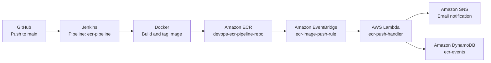

# Automated Docker Image Deployment to Amazon ECR with Jenkins, Lambda, and Terraform

## Project Overview

This project implements an end-to-end CI/CD workflow for a Dockerized Flask application. A push to the `main` branch starts a Jenkins pipeline that builds a Docker image, pushes it to Amazon ECR, and then relies on EventBridge to trigger Lambda for downstream notification and event logging.

The target architecture for this repository is:

`GitHub -> Jenkins -> Docker -> ECR -> EventBridge -> Lambda -> SNS -> DynamoDB`

## Architecture



### Component Responsibilities

- `GitHub` stores the application and pipeline code and emits the webhook on push.
- `Jenkins` checks out the repository, builds the container image, authenticates to ECR, and pushes the image.
- `Docker` packages the Flask app from the `app/` directory.
- `Amazon ECR` stores versioned images tagged with the Git commit SHA.
- `Amazon EventBridge` listens for successful ECR image push events.
- `AWS Lambda` filters the ECR event, sends an SNS notification, and writes an event record to DynamoDB.
- `Amazon SNS` sends an email notification for the new image push.
- `Amazon DynamoDB` stores a durable audit record of pushed images.
- `Terraform` provisions the AWS resources that support the workflow.

## Tech Stack

| Layer | Tools and Services |
| --- | --- |
| Source control | GitHub |
| CI/CD orchestration | Jenkins Pipeline, GitHub Webhooks |
| Containerization | Docker |
| Image registry | Amazon ECR |
| Event routing | Amazon EventBridge |
| Serverless processing | AWS Lambda, Python |
| Notifications | Amazon SNS |
| Event persistence | Amazon DynamoDB |
| Infrastructure as code | Terraform |
| Application | Flask |

## Setup Guide

### 1. Clone the repository

```bash
git clone https://github.com/AVISRJ062002/Automated-Docker-Image-Deployment-to-Amazon-ECR-with-Jenkins-Lambda-Integration-.git
cd Automated-Docker-Image-Deployment-to-Amazon-ECR-with-Jenkins-Lambda-Integration-
```

### 2. Update project variables

Edit `terraform/variables.tf` and review these values before deployment:

- `aws_region`
- `ecr_repo_name`
- `lambda_function_name`
- `sns_topic_name`
- `dynamodb_table_name`
- `email_subscription`

### 3. Build the Lambda deployment package

```bash
cd lambda
chmod +x build.sh
./build.sh
cd ..
```

### 4. Deploy the AWS resources

Use the helper script:

```bash
chmod +x scripts/deploy.sh
./scripts/deploy.sh
```

Or deploy manually with Terraform:

```bash
cd terraform
terraform init
terraform plan
terraform apply
```

### 5. Prepare the Jenkins server

Install the following on the Jenkins host:

- Docker
- AWS CLI
- Git

Install these Jenkins plugins:

- Git Plugin
- Pipeline Plugin
- Docker Pipeline Plugin
- AWS Credentials Plugin
- GitHub Integration Plugin

Add an AWS credential in Jenkins with:

- Type: `AWS Credentials`
- Credentials ID: `aws-creds`

The IAM user or role used by Jenkins should be able to authenticate to ECR and push images.

### 6. Create the Jenkins pipeline job

Create a Pipeline job with these settings:

- Job name: `ecr-pipeline`
- Definition: `Pipeline script from SCM`
- SCM: `Git`
- Repository URL: `https://github.com/AVISRJ062002/Automated-Docker-Image-Deployment-to-Amazon-ECR-with-Jenkins-Lambda-Integration-.git`
- Branch specifier: `*/main`
- Script path: `jenkins/Jenkinsfile`

Enable the trigger:

- `GitHub hook trigger for GITScm polling`

### 7. Configure the GitHub webhook

In the GitHub repository settings, add a webhook with:

- Payload URL: `http://<jenkins-public-ip>:8080/github-webhook/`
- Content type: `application/json`
- Event: `Just the push event`

### 8. Trigger the pipeline

Push a commit to `main`:

```bash
git commit --allow-empty -m "trigger pipeline"
git push origin main
```

### 9. Verify the deployment

Check the following after the build completes:

- Jenkins console output shows repository checkout, Docker build, ECR login, and Docker push.
- Amazon ECR contains a new image tag in `devops-ecr-pipeline-repo`.
- CloudWatch logs for `ecr-push-handler` show the Lambda execution.
- SNS sends the email notification.
- DynamoDB receives a new item in the `ecr-events` table.

## Pipeline Flow

1. A developer pushes code to the `main` branch in GitHub.
2. GitHub sends a push event to the Jenkins webhook endpoint.
3. Jenkins starts the `ecr-pipeline` job and checks out the repository.
4. `jenkins/Jenkinsfile` reads the short Git commit SHA and uses it as the Docker image tag.
5. Jenkins builds the application image from `app/Dockerfile`.
6. Jenkins authenticates to Amazon ECR through `scripts/ecr_login.sh` and the `aws-creds` credential.
7. Jenkins tags and pushes the image to `devops-ecr-pipeline-repo`.
8. Amazon ECR emits an image push event to EventBridge.
9. EventBridge invokes `lambda/lambda_function.py`.
10. Lambda ignores untagged OCI artifact events, processes tagged image push events, publishes an SNS message, and stores the event payload in DynamoDB.
11. Jenkins removes local Docker images and cleans the workspace.

## Screenshots

Store documentation screenshots in `docs/screenshots/README.md` using the filenames below:

- `docs/screenshots/jenkins-success-build.png` for a successful Jenkins pipeline run or console output
- `docs/screenshots/ecr-image-pushed.png` for the ECR repository showing the latest pushed image tag
- `docs/screenshots/lambda-cloudwatch-logs.png` for CloudWatch logs showing `SNS notification sent` and `Event stored in DynamoDB`

Suggested captures:

- Jenkins build history and console output
- ECR repository image tags
- Lambda CloudWatch log stream for the latest ECR event

## Troubleshooting

### Jenkins job is not triggered by GitHub push

- Confirm the repository webhook points to `http://<jenkins-public-ip>:8080/github-webhook/`.
- Make sure the Jenkins job has `GitHub hook trigger for GITScm polling` enabled.
- Verify the Jenkins root URL is configured correctly under `Manage Jenkins`.

### ECR authentication fails

- Ensure the Jenkins host has the AWS CLI installed.
- Confirm the Jenkins credential ID is exactly `aws-creds`.
- Verify the AWS principal has permissions such as `ecr:GetAuthorizationToken`, `ecr:InitiateLayerUpload`, `ecr:UploadLayerPart`, `ecr:CompleteLayerUpload`, and `ecr:PutImage`.

### Docker build or push fails

- Check that Docker is installed and the daemon is running on the Jenkins host.
- If Jenkins cannot talk to Docker, add the `jenkins` user to the `docker` group and restart the service.
- If `scripts/ecr_login.sh` returns a permission error, either run it with `bash ./scripts/ecr_login.sh` or mark it executable with `chmod +x`.

### Lambda runs but no notification or DynamoDB item appears

- Review CloudWatch logs for the `ecr-push-handler` function.
- Confirm the Lambda environment variables `SNS_TOPIC_ARN` and `DYNAMODB_TABLE` are set.
- Verify the Lambda execution role can publish to SNS and write to DynamoDB.

### SNS email is not received

- Confirm the email subscription is in `Confirmed` status in Amazon SNS.
- Check the spam folder for the confirmation and notification emails.
- Make sure Lambda is invoking `sns.publish` successfully in CloudWatch logs.

### Lambda receives unexpected ECR events

- Amazon ECR can emit untagged OCI artifact events alongside the tagged image push.
- The current Lambda handler safely skips events that do not include `image-tag`.

## Repository Layout

```text
devops-ecr-pipeline/
|-- app/
|   |-- app.py
|   |-- Dockerfile
|   `-- requirements.txt
|-- docs/
|   `-- screenshots/
|       `-- README.md
|-- jenkins/
|   `-- Jenkinsfile
|-- lambda/
|   |-- build.sh
|   |-- lambda_function.py
|   `-- requirements.txt
|-- scripts/
|   |-- deploy.sh
|   |-- ecr_login.sh
|   `-- run_app.sh
|-- terraform/
|   |-- main.tf
|   |-- outputs.tf
|   |-- provider.tf
|   `-- variables.tf
`-- README.md
```

## Cleanup

```bash
cd terraform
terraform destroy
```
